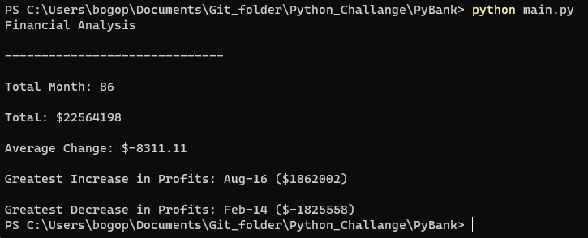
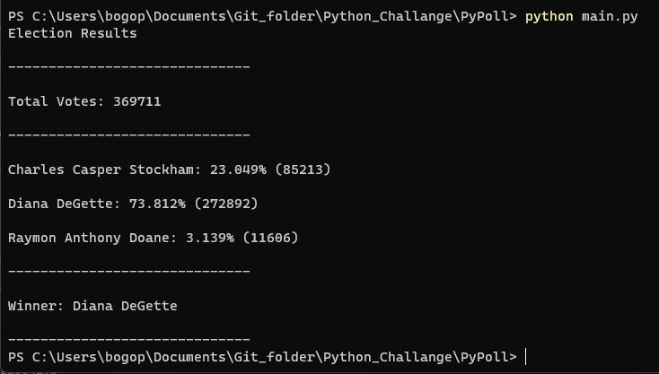

# Analysis of Corporate profits and election results
-There are two projects in this repository
***
# Project 1. Analysis of Corporate profits 


### Row data
-  The dataset is financial records of a certain company. And the dataset is composed of two columns: "Date" and "Profit/Losses". And the format of the file is "CSV"

### Main Idea
- There are just two columns. So I decied to use dictionary function after reading csv file
- It should be printed on the terminal and saved as a text file, so save it using the print option (~.file=~) to simplify code

### Detail
- I make two lists("date", "profit") convinently by using keys and values
```
with open (csv_path) as csv_file:
    csv_reader = csv.reader(csv_file, delimiter =",")
    csv_header = next(csv_reader)
    # Connvert Dict type
    dic_csv = dict(csv_reader)
    key_csv = list(dic_csv.keys())
    value_csv = list(map(int,dic_csv.values()))
```
*Note: You can also save the necessary information by calling each line.*
*For example, use "For loop"*
- Monthly profit changes are saved as a list. At this time, there is no change in profits in the first month, so it is set to 0.
```
change = [0] + [(value_csv[i] - value_csv[i-1]) for i in range(1,total_months)]
```
- Find the month corresponding to the maximum change value using the index. In fact, the monthly list and the change's list can be made into a single list using zip function, but it seems easier to use the index.
```
date_increase = key_csv[change.index(max_increase)]
```
- print on the terminal and save as text file using the print option 
```
    for j in range(len(contents)):
        print(contents[j])
        print(contents[j],file=file_csv)
```        
*Note: You can also save the necessary information by writting each line or lines .*
*For example, use "For loop, and write() or writelines()"*
### Result

***
# Project 2. Analysis of Election results 

### Row data
-  The dataset is a set of poll data. And the dataset is composed of theree columns: "Voter ID", "County", and "Candidate". And the format of the file is "CSV"

### Main Idea
- Just one "candidate column" is sufficient for analysis. Therefore, I selected just Candidate column from CSV files and made it into a list. And then I used "set()" to select unique values 
- Collecting Greatest value by using Sorted(list).
- It should be printed on the terminal and saved as a text file, so save it using the print option ("~".file="~") to simplify code
### Detail
- I make a list("candidate") by using "For Loop"
```
 csv_reader_list=[i[2] for i in csv_reader]
 ```
- Gather Unique candidate name by using Set() funtion
```
    # Use set function, collect name of candidates
    candidate = list(set(csv_reader_list))
```
- I make list(tuples) for printing by using For Loop
```
    # Candidate name, rate of vote, numbers of vote
    temp_list= [(candidate[j],
    round(csv_reader_list.count(candidate[j])*100/total_vote,3),
    csv_reader_list.count(candidate[j])) for j in range(len(candidate))]
```
- I need to sort by candidate name. So I decide not to use max() function for selecting winner. I just used sorted(). 
```
    # sort by name
    result_list=sorted(temp_list,key=lambda x: x[0])
    # sort by vote
    winner=sorted(temp_list,key=lambda x : -x[2])[0]
```
- print on the terminal and save as text file using the print option 
```
   # display on terminal and  save to txt file
    print(f"{'-' * 30}\n", f'Winner: {winner[0]} \n', f"{'-' * 30}", sep='\n')
    print(f"{'-' * 30}\n", f'Winner: {winner[0]} \n', f"{'-' * 30}", sep='\n', 
    file=file_csv)
```
### Result

***
# Require Subsequent Activity
- The above coding seems easier to use Pandas. In particular, changes in profit/loss in Project 1 will be easily obtained by using Pandas' "Shift()" function. After that, I will work using Pandas
***
# References
- Data for this dataset was generated by edX Boot Camps LLC, and is intended for educational purposes only.